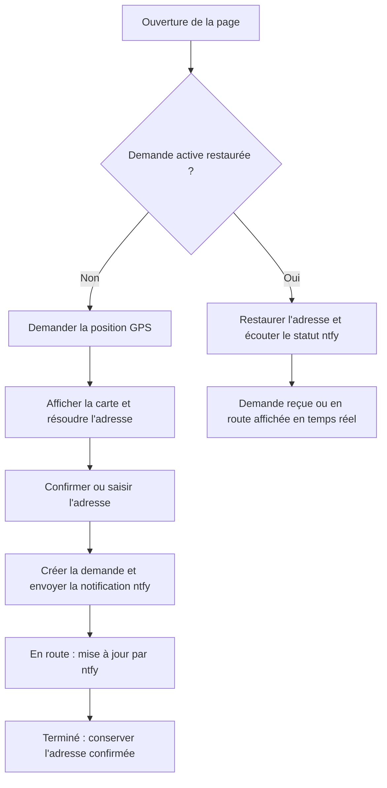
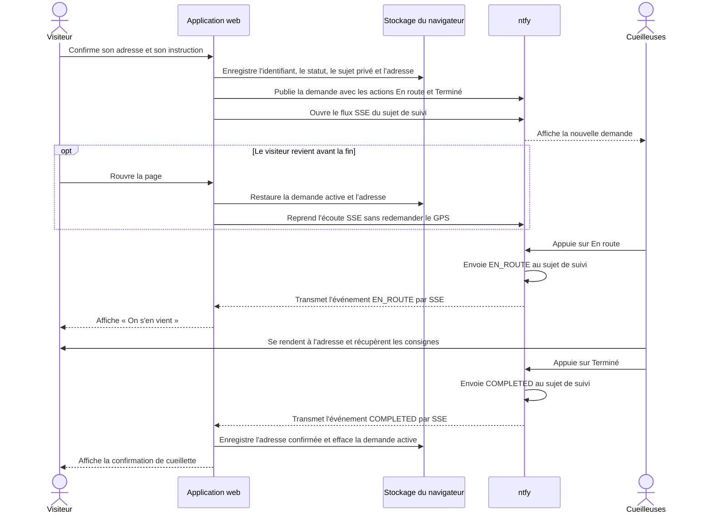

# Get Cannettes

Application web statique pour demander la cueillette de contenants consignés à domicile dans le secteur de Montchâtel (G2A), à Québec. Le projet a été lancé par deux jeunes filles qui organisent elles-mêmes les cueillettes.

Ce document décrit le fonctionnement technique pour aider une personne qui souhaite exploiter, adapter ou poursuivre le projet.

## Contenu du dépôt

- `index.html` : structure de l’application principale.
- `explications.html` : contenu de la page d’information destinée aux visiteurs.
- `css/app.css` et `css/explications.css` : styles propres à chaque page.
- `js/app.js` : formulaire, géolocalisation, stockage, envoi ntfy et suivi des demandes.
- `js/explications.js` : initialisation de la carte du secteur sur la page d’information.
- `README.md` : documentation technique du projet.
- `LICENSE` : texte de la GNU General Public License, version 2.

Il n’y a actuellement ni étape de compilation, ni gestionnaire de paquets, ni suite de tests automatisés. Les pages restent statiques : le HTML décrit leur structure, les feuilles CSS leur présentation et les scripts JavaScript leur comportement.

## Mise en route

Pour lancer un serveur de développement statique depuis le dossier du projet sous Windows :

```powershell
py -m http.server 8000
```

Sur macOS ou Linux, la commande habituelle est :

```sh
python3 -m http.server 8000
```

Ouvrir ensuite `http://localhost:8000/`. La géolocalisation du navigateur exige un contexte sécurisé : `localhost` convient au développement; un déploiement public doit utiliser HTTPS. Il est aussi possible d’ouvrir directement `index.html`, mais le comportement des permissions GPS varie selon le navigateur et l’origine `file://`.

Les pages chargent leurs dépendances et données à distance : Leaflet 1.9.4 via unpkg, les tuiles OpenStreetMap, Nominatim pour le géocodage inversé et ntfy pour les notifications et le suivi.

## Parcours d’une demande

1. Au chargement, une demande active est restaurée en premier. Sinon, une adresse confirmée enregistrée est réutilisée sans GPS; en son absence, le navigateur demande la position.
2. La position sert à afficher la carte, vérifier si le point se trouve dans le secteur desservi et rechercher une adresse avec Nominatim.
3. L’adresse détectée ou réutilisée apparaît dans le champ et peut être corrigée. Si la géolocalisation est refusée ou échoue, le visiteur peut saisir une adresse manuellement.
4. Le visiteur choisit l’instruction de cueillette : laisser les consignes près de la porte (🚪) ou sonner (🔔), puis envoie la demande.
5. L’application envoie une notification ntfy contenant l’adresse, l’instruction sous forme d’icône, et soit un lien de carte, soit l’indication que l’adresse a été saisie manuellement.
6. La notification propose aux cueilleuses les actions « En route » et « Terminé ». La page du visiteur suit les changements d’état en temps réel.
7. À l’état « Terminé », l’adresse est enregistrée comme adresse confirmée pour les prochaines demandes.



### Échanges entre le visiteur et les cueilleuses

Ce diagramme détaille le cycle d’une demande, y compris le cas où le visiteur ferme puis rouvre la page avant la fin de la cueillette.



Les deux actions ntfy ont `clear: true` : une action réussie peut retirer la notification entière de la zone de notifications. L'événement de statut est tout de même transmis à la page par SSE.

## Configuration principale

Les constantes de configuration se trouvent au début de `js/app.js`.

- `NTFY_TOPIC` : sujet ntfy principal auquel la notification de demande est envoyée. Il doit être propre au déploiement et difficile à deviner.
- `NTFY_BASE_URL` : serveur ntfy utilisé, actuellement `https://ntfy.sh/`.
- `REQUEST_MAX_AGE` : durée maximale de restauration d’une demande active, actuellement 24 heures.
- `CACHE_RADIUS_METERS` : distance GPS maximale pour réutiliser l’adresse du cache géolocalisé, actuellement 50 mètres.
- `SECTEUR_DESSERVI` : sommets du polygone utilisé par Leaflet et par la vérification d’inclusion.

Le serveur ntfy est public dans cette configuration et le code HTML est téléchargeable par tous. Le nom du sujet n’est donc pas un secret fiable : choisir un sujet difficile à deviner réduit les risques de notifications parasites, mais ne protège pas à lui seul les données. Les messages transmis comprennent une adresse et, si le GPS est utilisé, des coordonnées. Ne jamais placer de jeton ou de mot de passe dans le code client. Pour des données sensibles, il faudrait revoir l’architecture et les contrôles d’accès avant le déploiement.

## Notifications et suivi ntfy

Lors de l’envoi, `creerDemandeActive` crée un identifiant lisible et un sujet de suivi aléatoire :

```text
<NTFY_TOPIC>_s_<32 caractères hexadécimaux>
```

La demande active est enregistrée dans le stockage local du navigateur avant l’envoi. Le message principal est publié par HTTP POST sur la racine ntfy avec le sujet, le titre, le corps et deux actions HTTP :

- « En route » envoie `EN_ROUTE` au sujet de suivi de cette demande.
- « Terminé » envoie `COMPLETED` au même sujet.

La page écoute le flux SSE (`/sse?since=all`) de ce sujet. `recevoirStatutDemande` ignore les événements non pertinents, passe une demande `pending` à `EN_ROUTE`, puis affiche l’état terminé lorsque `COMPLETED` arrive. La notification utilise actuellement `clear: true` sur les deux actions : après une action réussie, ntfy retire toute la notification. Cela évite de réutiliser ses boutons, mais ne permet pas de griser une action individuellement tout en gardant l’autre visible.

Au rechargement, `restaurerDemandeActive` valide l’horodatage, l’âge, le format du sujet et l’état. Seuls les états `pending` et `EN_ROUTE` sont restaurés. Une demande active empêche une nouvelle demande GPS; l’adresse provient en priorité de la demande sauvegardée, puis du cache local, puis de l’adresse confirmée. Les boutons du formulaire sont verrouillés pendant ce suivi.

Le statut « Demande reçue » calcule une attente selon l’heure et le jour locaux de l’appareil : semaine, de 16 h à 19 h; fin de semaine, de 8 h à 11 h. Pendant une plage, le message indique le temps restant jusqu’à sa fin; hors plage, il annonce la prochaine plage.

## Adresse et stockage local

Les données restent dans le stockage du navigateur, propres à l’origine du site et à l’appareil. Elles ne sont pas partagées entre un lancement `file://`, `localhost` et le domaine de production.

- `canetteGet.location.v1` : objet JSON avec `lat`, `lon` et `address`. Il sert à réutiliser l’adresse si la prochaine position se trouve à moins de 50 mètres.
- `canetteGet.confirmedAddress.v1` : dernière adresse d’une demande marquée terminée. Cette valeur est réutilisée même lorsque la géolocalisation échoue.
- `active_request_id`, `active_request_created_at`, `active_request_status_topic`, `active_request_status`, `active_request_address` : état nécessaire pour restaurer et suivre une demande en cours. Ces clés sont supprimées quand la demande est terminée, expirée, invalide ou réinitialisée.

Le bouton « Réinitialiser » efface les clés de stockage local utilisées par l’application (demande active, cache GPS et adresse confirmée), puis recharge la page. Il ne peut pas annuler une demande qui a déjà été transmise aux cueilleuses.

## Carte et polygone du secteur

La carte de `index.html` utilise Leaflet et les tuiles OpenStreetMap. Le polygone `SECTEUR_DESSERVI` définit à la fois la zone colorée et le test `positionDansSecteur`. La carte de `explications.html` possède sa propre copie du polygone; penser à synchroniser les deux listes quand la zone change.

Pour générer ou modifier les sommets avec [geojson.io](https://geojson.io/) :

1. Ouvrir geojson.io et tracer un objet **Polygon** sur la carte.
2. Exporter ou copier le GeoJSON et repérer `features[0].geometry.coordinates[0]`, qui contient l’anneau extérieur.
3. GeoJSON écrit chaque point dans l’ordre `[longitude, latitude]`. Leaflet reçoit ici chaque point dans l’ordre `[latitude, longitude]` : inverser les deux valeurs de chaque paire.
4. Conserver les coordonnées décimales et répéter le premier point à la fin de la liste pour fermer l’anneau.
5. Remplacer la liste dans `SECTEUR_DESSERVI` de `index.html`, puis appliquer la même liste à `montchatelPolygon` dans `explications.html`.
6. Vérifier visuellement la carte et tester un point à l’intérieur ainsi qu’un point à l’extérieur. Les coordonnées doivent être celles du système WGS84 utilisé par GeoJSON et GPS.

Exemple de conversion :

```text
GeoJSON : [longitude, latitude] = [-71.3968156, 46.8464834]
Leaflet  : [latitude, longitude] = [46.8464834, -71.3968156]
```

## Services externes et confidentialité

- **Géolocalisation du navigateur** : nécessite l’autorisation du visiteur et un contexte sécurisé. Le point GPS sert à la carte, au contrôle du secteur et au géocodage.
- **Nominatim / OpenStreetMap** : `reverseGeocode` demande l’adresse correspondant aux coordonnées GPS; aucune clé d’API n’est configurée.
- **Tuiles OpenStreetMap** : Leaflet télécharge les tuiles à la demande. Conserver l’attribution visible fournie par Leaflet et respecter la politique d’utilisation du service de tuiles.
- **ntfy** : reçoit l’adresse, l’instruction de dépôt et soit les coordonnées GPS et le lien OpenStreetMap, soit l’indication de saisie manuelle. Les sujets ntfy publics sont accessibles à quiconque les connaît.
- **Stockage navigateur** : l’adresse et l’état actif sont conservés localement pour faciliter le retour et le suivi; vider les données du site les supprimera.

## Vérifications manuelles

Il n’existe pas encore de tests automatisés. Avant de publier une modification, vérifier au minimum :

1. Autoriser le GPS : la carte, la position, l’adresse et le contrôle du secteur s’affichent.
2. Refuser le GPS ou simuler son indisponibilité : la saisie manuelle permet d’envoyer une demande avec l’adresse.
3. Soumettre une demande : ntfy reçoit une notification avec la bonne adresse, l’icône 🚪 ou 🔔 et les deux actions.
4. Utiliser « En route » : la page active affiche le statut correspondant; recharger la page restaure le suivi sans redemander le GPS.
5. Utiliser « Terminé » : l’état se ferme après son bref affichage et l’adresse reste mémorisée.
6. Tester « Réinitialiser » avec une demande active : annuler conserve le suivi; confirmer efface toutes les données locales de l’application et relance le parcours initial.
7. Tester les messages d’attente avant, pendant et après les plages horaires, en semaine et la fin de semaine.

## Pistes pour continuer le projet

- Ajouter des tests automatisés pour la géométrie, les horaires, le cycle d’état et la restauration du stockage.
- Déplacer les paramètres de déploiement dans une configuration générée, tout en évitant les secrets dans le navigateur.
- Pour griser les actions ntfy une à une et garder l’autre disponible, ajouter un service avec état qui valide les transitions et met à jour la notification; une page statique seule ne peut pas maintenir cet état de façon fiable.
- Vérifier régulièrement les politiques et limites de Nominatim, des tuiles OpenStreetMap et de ntfy.sh.
- Mettre à jour également `explications.html`, les messages destinés aux visiteurs et les vérifications manuelles lorsque les heures ou le secteur changent.

## Licence

Le dépôt contient le texte de la GNU General Public License version 2 dans `LICENSE`. Toute redistribution ou modification doit respecter les conditions applicables de cette licence.
